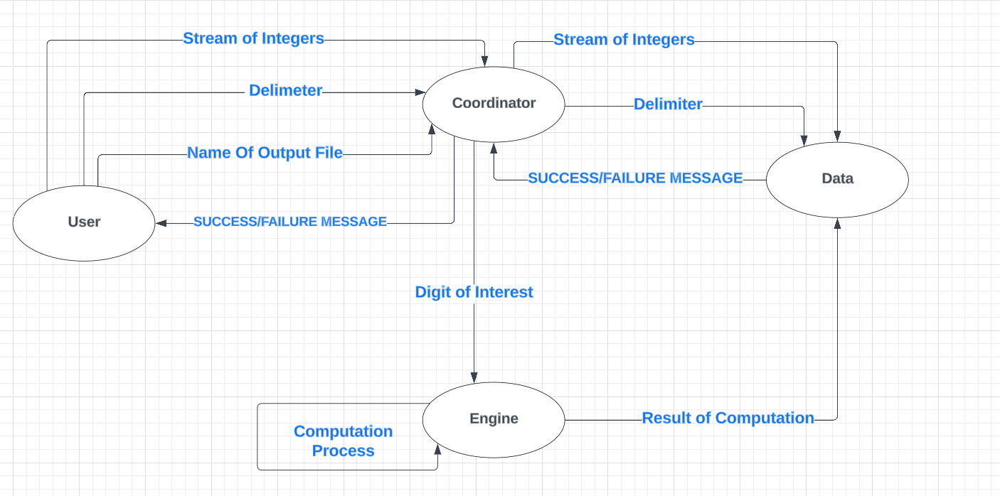
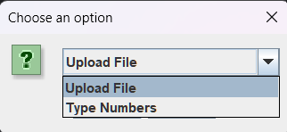
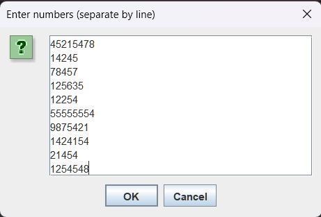
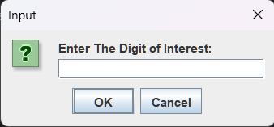
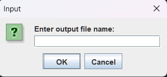
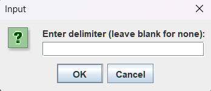
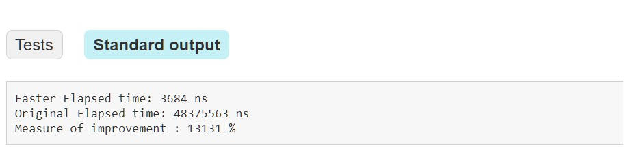

# Digit Detective

## Introduction
Welcome to Digit Detective, an efficient engine designed to analyze streams of integers and count occurrences of specified digits within given ranges. This readme provides comprehensive information on the project's functionality, architecture, and usage guidelines.

## Functionality
The Digit Detective engine processes a potentially infinite stream of positive integers, analyzing each number's range from 0 to the provided integer (inclusive). The user specifies a digit of interest, and the engine counts the occurrences of this digit within the given range. Only positive integers within the range of 1 to Integer.MAX_VALUE are accepted by the engine.

## Components
The project consists of three main components:

1. System Coordinator: This component, represented by the SystemCoordinator interface, orchestrates the overall flow of requests and responses within the system. It receives a ComputeRequest object, which encapsulates the necessary information for computation, and coordinates the execution of the compute engine.
2. Data API: Implemented by the DataImp class, this component handles the input data. The dataIn method extracts integers from the provided IntegersFromTheUser object, which likely represents user input. Additionally, the computationEndMessage method is responsible for signaling the completion of computation and providing a message indicating success or failure.
3. Compute Engine API: Defined by the ComputeEngine interface, this component performs the computation on the provided stream of integers.

## Usage
Input
Users can provide the stream of numbers
either by typing them in or by uploading a
file containing the numbers. Along with the stream,
users specify the digit of interest,
name of the output file, and a delimiter (Optional) for the output file.

Output

Upon receiving a computation request,
the system automatically creates an output
file named by the user. The results are written
in the format <Upperlimit>:<Digit's Occurrence><Delimiter>.

Example of delimiter = "/", digit = 5, and upperLimit = 55555 -> 55555:27780/

## Testing
The project includes comprehensive unit tests to ensure the correctness of each API. Additionally, an integration test evaluates the system's overall correctness and functionality.
[LINK TO THE TEST FOLDER](https://github.com/salmaKahlil/SoftwareEngineeringProject/tree/main/test)

## Multithreading
To improve performance, the system supports multithreading. The computation process runs on four threads, enabling efficient processing of the input stream

## Enhancing Computation Algorithm

To improve the efficiency and performance of the computation algorithm, several enhancements were implemented in the NewComputeEngineImp class. These enhancements address various considerations, including reducing unnecessary looping over large ranges and optimizing digit counting.

Key Enhancements:

1. Optimized Digit Analysis: Instead of iterating over each integer in the range, the algorithm directly analyzes the digits of the upper limit. This reduces unnecessary looping, especially for large ranges.
2. Efficient Counting: The algorithm calculates occurrences of the specified digit by considering the position and magnitude of digits in the upper limit. This approach optimizes the counting process and improves overall efficiency.

[LINK TO THE SLOW ALGORITHM](https://github.com/salmaKahlil/SoftwareEngineeringProject/blob/main/src/software/project/ComputeEngineImp.java)

[LINK TO THE EFFICIENT ALGORITHM](https://github.com/salmaKahlil/SoftwareEngineeringProject/blob/main/src/software/project/NewComputeEngineImp.java)

[LINK TO THE BENCHMARK TEST](https://github.com/salmaKahlil/SoftwareEngineeringProject/blob/main/test/performancetuning/TestBench.java)

## Graphical User Interface (GUI)
A Java-based GUI facilitates user interaction. gRPC is utilized to manage requests and responses between the GUI and the system.

## Getting Started
To get started with the project, follow these steps:

1. Clone the repository.
2. Install dependencies as specified in the project documentation.
3. Build and run the project according to the provided instructions.

## Contributors
1. Salma  Khalil
2. Maira Nadeem
3. Hadassah Grimaldi